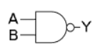
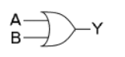
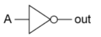
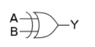
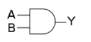

# 1과목 - 컴퓨터 구조

 

1. 다음 중 가장 먼저 개발된 컴퓨터는 무엇인가? (라)

   가. ENIAC (Electronic Numerical Integrator and Calculator)

   나. UNIVAC-1 (Universal Automatic Computer-I)

   다. CDC6600 (Control Data Corporation)

   라. Apple II

    

   ⇒ ENIAC(1943~1946) → UNIVAC-1(1951) → CDC6600(1964) → Apple II(1977)

   	- https://www.computerhistory.org/timeline/computers/

 

2. 동시에 동작하는 복수의 마이크로프로세서를 갖추고 있는 컴퓨터에 의해서만 실행될 수 있는 처리 방식으로, 복수의 처리 장치를 사용하여 모든 처리 장치가 하나의 프로그램상의 서로 다른 태스크를 동시에 처리함으로써 처리의 부하를 분담하여 처리 속도를 향상시키는 방법은 무엇인가? (나)

   가. 리셋

   나. 병렬처리

   다. DMA

   라. 인터럽트

 

3. 데이터를 표현할 때, 큰 단위의 바이트가 앞에 오는 방법을 무엇이라 하는가? (나)

   가. little endian

   나. big endian

   다. bad endian

   라. good endian

 

4. 다음 중 컴퓨터 내부의 부품에 활용되는 논리게이트의 표현이 적절하지 못한 것은 어느 것인가? (가)

   | 논리         | 회로 기호                                    |
   | ------------ | -------------------------------------------- |
   | 가. AND      |  |
   | 나. OR       |  |
   | 다. Inverter |  |
   | 라. XOR      |  |

    

   ⇒ 

   | 논리 | 회로 기호                                    |
   | ---- | -------------------------------------------- |
   | AND  |  |
   | NAND |  |

 

5. CPU의 빠른 처리 속도와 주기억장치의 느린 속도 차이를 효율적으로 조율하기 위해서 사용하는 것은? (라)

   가. 산술논리연산장치(ALU)

   나. 바이오스(BIOS)

   다. 플립-플롭(Flip-Flop)

   라. 캐시(Cache)

 

6. DMA(Direct Memory Access)에 대한 설명이다. 옳지 않은 항목은? (라)

   가. 주변장치들이 메모리에 직접 접근하여 읽거나 쓸 수 있도록 하는 기능이다.

   나. 메모리의 일정 부분이 DMA에 사용될 영역으로 지정된다.

   다. 전송이 끝나면 DMA 제어긴는 CPU를 인터럽트 한다.

   라. DMA가 지원되면 CPU가 데이터 전송에 관여하므로 컴퓨터 성능이 좋아진다.

    

   ⇒ DMA : CPU를 통하지 않고 데이터를 메모리와 메모리 또는 메모리와 입출력장치 간에 직접 전송하는 방식

   	- 데이터 전송 시 CPU 개입이 없어 효율성이 높아짐

 

7. -124를 16 비트의 2의 보수 값으로 변환한 후에, 이를 16진수로 표현하면? (가)

   가. 0xFF84

   나. 0xFF67

   다. 0xFFA3

   라. 0xFE91

    

   ⇒ 124 : 0000 0000 0111 1100

   	- 1의 보수 : 1111 1111 1000 0011
   	- 2의 보수 : 1111 1111 1000 0100 = 0xFF84

 

8. ASCII에 대하여 잘못 설명한 것은? (다)

   가. 영문, 숫자, 문자에 대한 표준 2진 코드

   나. 7비트 사용하여 128개 문자를 코드화 한 것

   다. 제어 문자는 해당되지 않음

   라. %, @, $와 같은 특수 문자도 포함함

    

   ⇒ 제어 문자 33자 포함 (0x00~0x1F, 0x7F)

 

9. 다음 중 오버플로(overflow)에 대한 설명으로 적절하지 않은 것은 무엇인가? (라)

   가. 2개의 n비트 숫자로 시작해서 합이 (n+1)비트를 차지하면 오버플로가 일어난다.

   나. 2개의 부호화되지 않은 숫자가 더해지면, 최상위 위치에서 발생하는 마지막 캐리에서 오버플로가 검출된다.

   다. 부호화된 2의 보수의 경우, 최상위 비트는 항상 부호를 나타낸다.

   라. 둘 모두 양수이거나 음수인 숫자가 더해지는 경우, 오버플로는 항상 일어나지 않는다.

    

   ⇒ 오버플로 발생 조건

    - 부호 있는 숫자의 덧셈
      	- 두 개의 숫자가 양수일 때 결과값이 음수
         	- 두 개의 숫자가 음수일 때 결과값이 양수

    - 부호 없는 숫자의 덧셈
      	- 최상위 비트를 넘어가는 캐리 발생

 

10. 클록 펄스가 플립플롭의 상태를 제어하고 있을 때, 입력이 그 플립플롭에 나타나는 래치와 클록 펄스가 있는 동안 플립플롭에 가해진 입력이 플립플롭의 상태를 제어하고, 플립플롭의 상태는 클록 펄스가 없을 때만 변하도록 2개의 래치를 결합하는 회로를 무엇이라고 하는가? (나)

    가. 에지 트리거드(edge-triggered) 플립플롭

    나. 마스터슬레이브(master-slave) 플립플롭

    다. 밀리(Mealy) 모델 회로

    라. 무어(Moore) 모델 회로

 

11. 시프터(Shifter)에 대한 설명으로 옳지 않은 것은 무엇인가? (가)

    가. 버스(Bus)로부터 데이터가 레지스터에 병렬로 전송되고 그 다음 오른쪽으로만 시프트 된다.

    나. m비트 오퍼랜드를 가지는 시스템에서는 m개의 단계의 시프터를 구성한다.

    다. 하나의 오퍼랜드에 대하여 n>1비트 위치를 시프트하기 위해서는 1비트 위치의 시프트를 n번 연속적으로 수행해야 하며, 이 경우 n개의 클록 사이클이 소요된다.

    라. 배럴 시프터(barrel shifter)는 한 클록 사이클 동안 데이터를 한 비트 위치 이상을 시프트 해야 하는 경우에 사용된다.

     

    ⇒ 시프트 레지스터

    	-  데이터를 저장하거나 데이터를 옆으로 이동할 때 사용되는 회로
     - SIPO(직렬 입력, 병렬 출력), SISO(직렬 입력, 직렬 출력), PISO(병렬 입력, 직렬 출력), PIPO(병렬 입력, 병렬 출력)
       	- 왼쪽 → 오른쪽
     - 양방향 시프트 레지스터 
       	- 방향을 다르게 할 수 있음

    ⇒ 배럴 시프터

    		- 하나의 연산으로 데이터 워드 내에 있는 다수의 비트를 이동하거나 회전시킬 수 있는 하드웨어 장치

 

12. 명령어 셋 아키텍쳐(ISA, Instruction Set Architecture)를 구성하는 어드레스 영역에 대한 설명으로 옳은 것은 무엇인가? (가)

    가. 명령어에 연산코드(opcode)가 인지되면 연산 수행을 위한 제어 워드들이 데이터 처리장치에 가해진다.

    나. 단순 컴퓨터에 대한 명령어 형식은 2가지가 있다.

    다. 분기(branch)가 일어나더라도 새로운 어드레스가 만들어지지 않는다.

    라. 점프(jump)나 분기(branch) 명령어의 경우 항상 레지스터 파일이나 메모리도 변화시킨다.	

     

    ⇒ 명령어 형식

    - 0 - 주소 명령어 : 연산코드
    - 1 - 주소 명령어 : 연산코드 + 오퍼랜드
    - 2 - 주소 명령어 : 연산코드 + 오퍼랜드1 + 오퍼랜드2
    - 3 - 주소 명령어 : 연산코드 + 오퍼랜드1 + 오퍼랜드2 + 오퍼랜드3

 

13. 다음 RISC(Reduced Instruction Set Computer)에 대한 설명으로 옳지 않은 것은 무엇인가? (라)

    가. RISC의 목표는 간단한 명령어이다.

    나. RISC는 비교적 큰 레지스터 파일이 필요하다.

    다. RISC는 높은 스루픗(throughput)과 빠른 실행속도를 목표로 한다.

    라. RISC의 제어 장치는 비교적 복잡하다.

     

    ⇒ RISC

    - CPU 명령어의 개수를 줄여 하드웨어 구조를 간단하게 만드는 방식
    - 많은 수의 레지스터를 사용하여 메모리 접근을 줄임
      - 메모리 접근 횟수가 감소해 시스템 수행속도 전체적으로 향상
    - 제어 장치 단순화

 

14. 다음 설명 중 옳지 않은 것은 무엇인가? (다)

    가. CPU와 입출력 사이의 전송 방법에는 별도의 어드레스 공간을 갖는 독립 입출력과, 메모리 어드레스 공간의 일부를 사용하는 메모리 맵 입출력이 있다.

    나. 프로시저(procedure)는 주어진 계산 작업을 수행하는 일련의 명령어들을 자체적으로 가지고 있고, 서브루틴(subroutine)이라고도 불린다.

    다. 부동소수점 형식과 연산은 산술연산에서 더 좁은 범위의 오퍼랜드 값을 처리할 수 있게 한다.

    라. 프로그램 가로채기(interrupt)는 정상적인 프로그램 진행 순서에서 벗어나야 할 상황이 생겼을 때 그에 대응하기 위하여 사용된다.

     

    ⇒ 부동소수점

    - 실수 표현시 소수점의 위치를 고정하지 않고 그 위치를 나타내는 수를 따로 적는 것
    - 유효숫자를 나타내는 가수와 소수점의 위치를 알 수 있는 지수로 표현
    - 고정소수점 방식보다 넓은 범위의 수를 나타낼 수 있지만, 연산 속도가 느림

 

15. 다음 입출력에 관한 설명 중 옳지 않은 것은 무엇인가? (다)

    가. 컴퓨터에 연결된 주변 장치와 CPU와의 인터페이스를 위해 특별한 통신 링크가 필요하고, 주변 장치의 데이터 전송 속도는 CPU의 클록 속도와 다르다.

    나. CPU와 인터페이스의 통신에서 비동기 데이터 전송시, 전송 시점을 나타내는 핸드세이킹(handshaking)이라는 제어 신호가 필요하다.

    다. 스트로빙(strobing) 방법은 전송의 타이밍을 다루기 위해 2개의 제어 신호를 사용한다. 양쪽 장치의 능동적인 요구와 응답으로 데이터 전송이 이루어진다.

    라. 두 장치 사이에서는 직렬과 병렬 데이터 전송이 가능하다. 직렬 통신은 속도가 느리지만 비용이 적게 든다.

     

    ⇒ 스트로빙

    - 데이터 버스와 한 개의 제어선 이용
    - 두 개의 독립적인 장치 사이에서 비동기적인 데이터 전송을 이루기 위해 전송시각을 알리는 제어 신호를 스트로브 신호라 하며, 한 개의 제어선을 통해 상호 교환

 

16. 다음의 16비트 레지스터가 메모리에 저장될 때, 프로세서에 따라 빅 엔디안(big endian)과 리틀 엔디안(little endian) 방식으로 저장된다. 레지스터에 "0A0B0C0D"(왼쪽 끝이 MSB, 오른쪽 끝이 LSB)의 데이터가 있다면 빅 엔디안 프로세서의 메모리에는 어떤 식으로 이 값이 저장되는가? (가)

    | 메모리 주소 | 0x10 | 0x11 | 0x12 | 0x13 |
    | ----------- | ---- | ---- | ---- | ---- |
    | 가.         | 0A   | 0B   | 0C   | 0D   |
    | 나.         | 0B   | 0A   | 0D   | 0C   |
    | 다.         | 0C   | 0D   | 0A   | 0B   |
    | 라.         | 0D   | 0C   | 0B   | 0A   |

 

17. 10진법 값 -128을 2의 보수(two's complement) 표현법으로 올바르게 표현한 것은? 아래의 2진 비트 표현은 왼쪽 끝이 msb(most significant bit)에 해당함. (라)

    가. 0111 1111

    나. 1000 0010

    다. 1000 0001

    라. 1000 0000

     

    ⇒ 128 : 0000 0000 1000 0000

    - 1의 보수 : 1111 1111 0111 1111
    - 2의 보수 : 1111 1111 1000 0000 = 0xFF80

 

18. 실수를 컴퓨터에서 표현하는 방식 중에서 부동 소수점 방식(floating point representation)이 있다. 이 중에서 32비트 부동 소수점 표현 방식인 IEEE 754-1985 방식은 1비트 길이의 sign bit와 8비트 exponent, 23비트의 fraction으로 구성된다. 10진수 -2.0을 IEEE 754-1985 형식으로 올바르게 표현한 것은? (라)

    가. 1.0000000000000000000000000000000 X 20

    나. -1.0000000000000000000000000000000 X 20

    다. 1.00000010 00000000000000000000000

    라. 1.00000000 00000000000000000000000

     

    ⇒ -2.0 : -10.0000000.... → 정규화 : -1.0000000... X 21

    - 정수부
      - -2 = -10
    - 소수부 : 해당 값에 2를 곱해서 그 결과값이 1을 넘지 않으면 0, 1을 넘으면 1이라고 나타내고 결과값에서 1을 뺌. 결과값이 1이 나올때까지 반복
      - 0.0 * 2 = 0 → 0 : 반복 ⇒ 0000000....

    ⇒ 부동소수점 표현 : 1 10000000 00000000000000000000000

    - sign bit : 1 (음수)
    - exponent :  127 + 1 = 128 : 10000000
    - fraction(mantissa) : 00000000000000000000000

 

19. 부동 소수점에 대한 설명으로 틀린 것은? (나)

    가. 실수를 표현할 때, 소수점의 위치를 고정하지 않고 그 위치를 나타내는 영역이 따로 존재한다.

    나. 부동 소수점 표현 방식에서는 작은 값에 대해서는 오차가 존재하지 않지만 Exponent의 표현 범위를 넘어서는 값에 대해서는 오차가 존재한다.

    다. IEEE 754 부동 소수점 표현 방식은 sign 비트와 exponent, mantissa 비트 영역으로 구성된다.

    라. IEEE 754 부동 소수점 표현 방식에서 모든 비트의 값이 0인 경우, 0의 값을 의미한다.

     

    ⇒ 부동소수점의 오차

    - 숫자가 2진으로 저장되기 때문에 발생
      - 실수를 유한 개의 비트로 표현해야 함
    - 컴퓨터는 그 값과 가장 근사한 근삿값을 반환